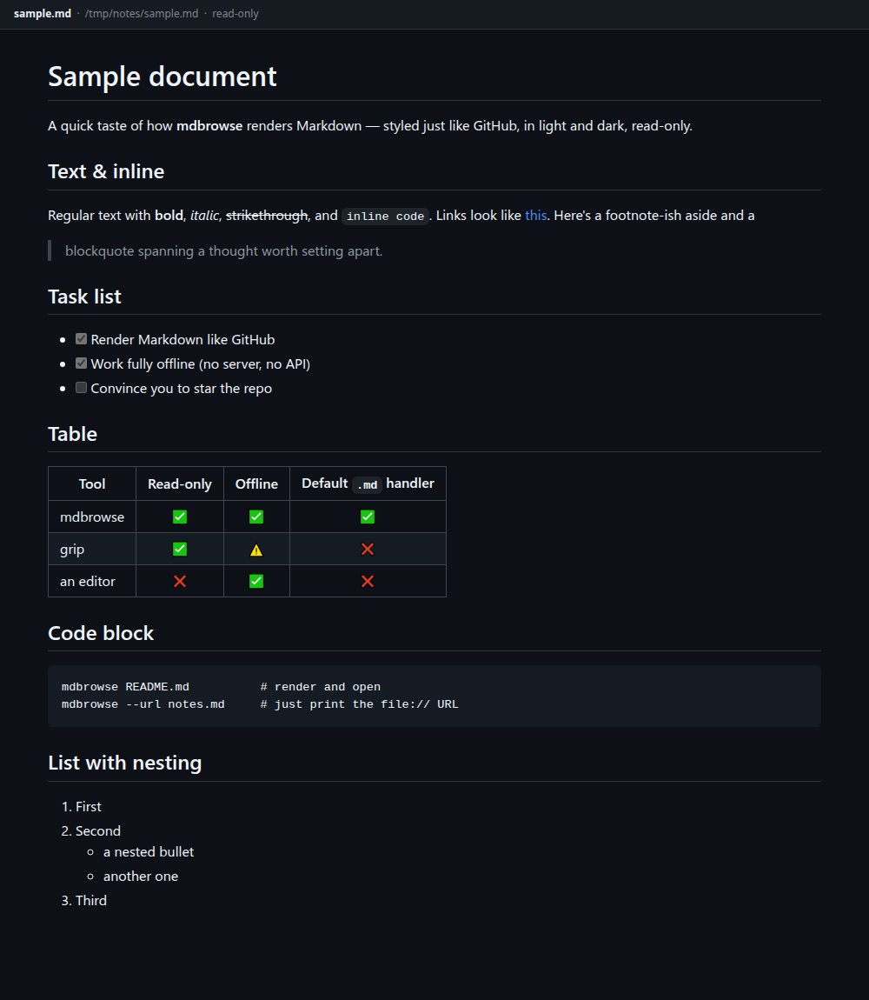

# mdbrowse

**Double-click a `.md` file and read it, rendered like GitHub.** That's it.
One bash script, no install, read-only, fully offline.



## The problem

Markdown is everywhere now — READMEs, notes, docs, Obsidian vaults, whatever your
AI tools spit out. On GitHub it looks great: headings, tables, task lists, images.
The moment the same file is sitting **on your disk**, though:

- **Double-clicking it** opens an editor — or a wall of `##` and `**asterisks**`.
  You wanted to *read* it, not edit it.
- **Your browser** can't render Markdown. It shows you the raw text.
- **Your IDE** renders it fine, but launching a full IDE to read one file is
  driving to the next room.

What's missing is the most ordinary thing imaginable: a **viewer**. You have one
for images. You have one for PDFs. For Markdown, you don't.

## What mdbrowse does

It registers itself as your default `.md` application. From then on you double-click
any Markdown file and it opens **in your browser, rendered exactly like GitHub** —
light and dark, tables, code blocks, images. Nothing more. You can't edit it, which
is the point: you can't accidentally clobber it either.

Four things it does that the alternatives don't:

**You can click through a whole tree of notes.** Got an index linking ten other
files? The links work — targets are pre-rendered recursively and rewritten to point
at each other, anchors included. Everything else opens one file and leaves you there.

**A hostile document can't bite you.** Markdown is allowed to contain raw HTML. Download
a `.md` from a stranger, double-click it, and on a `file://` origin someone else's
JavaScript runs right next to your files. mdbrowse sanitizes the HTML before it reaches
the page — the only one of the three comparable tools that does (verified in their
source, not their README). See *Security* below.

**Nothing to install, nothing to trust.** One bash script. No Python, no npm, no
binary you have to take on faith — read the ~400 commented lines yourself. It never
touches the network: no server, no API, no telemetry, ever.

**It works where your browser can't reach.** If your browser came from Snap or Flatpak —
which on Ubuntu, Fedora and Pop!_OS it probably did — it runs in a sandbox and **cannot
read hidden directories**. Notes under `~/.config/` or `~/.notes/` simply won't open.
mdbrowse reads the file itself and writes the rendered page somewhere the sandbox *can*
reach. You don't have to know any of this: `install.sh` detects it and sets it up.

**Who it's not for.** You don't write in it, you read. No Mermaid diagrams, no math.
Linux only. And the rendered page needs JavaScript enabled.

## Alternatives

Worth naming, because they're good and you may well prefer them:

- **[mdview](https://github.com/mapitman/mdview)** (Go) does the same thing — Markdown to a
  GitHub-styled page in your browser, no server. It is packaged properly (AUR, deb, rpm, Snap),
  runs on macOS and Windows too, and it renders **Mermaid diagrams**, which mdbrowse does not.
- **[mdopen](https://github.com/immanelg/mdopen)** (Rust) serves your files over a local HTTP
  server with **hot reload**, syntax highlighting and math — nicer if you are *writing* and
  want the page to refresh as you save.
- **grip** renders exactly like GitHub, but runs a local server and wants Python + the GitHub API.
- **glow / mdcat** are terminal-only.
- **Marker / Apostrophe / ghostwriter** are *editors* — heavy, and not what you want for a quick read.
- Browser extensions must be installed into the browser and don't handle a double-click in your file manager.

## How it works

The browser can't render Markdown — but it renders HTML. So mdbrowse wraps your
`.md` into one self-contained HTML page:

1. It inlines **github-markdown-css** (GitHub look, light + dark), **marked.js**
   (a GitHub-flavored Markdown parser) and **DOMPurify** (an HTML sanitizer), and
   carries your Markdown along as base64.
2. On load, `marked` parses it in the browser, `DOMPurify` sanitizes the result,
   and only then is it injected into the page.
3. The page is written to a cache dir and opened in your browser.

So the actual Markdown→HTML conversion happens **client-side** via `marked`; the
script only assembles the wrapper. No runtime dependencies, fully offline.

**YAML front matter** — the `---` block Hugo, Jekyll and Obsidian notes start with —
is rendered as a table, the way GitHub renders it. (Left to `marked`, the closing
`---` reads as a heading underline and the whole block becomes one giant `<h2>`.)

**Relative images are embedded** as `data:` URIs, so the page carries its own
pictures — it still renders if you move it, and a confined browser doesn't have
to reach back into your source directory to load them. Images above
`MDBROWSE_MAX_IMAGE` (5 MiB) are linked rather than inlined.

**Relative links** to other `.md` files (e.g. an index that links its siblings)
are handled: mdbrowse scans them, **pre-renders the targets recursively**, and
rewrites the links to point at the rendered HTML — so you can click through a
tree of notes and always get rendered pages.

## Security

**Untrusted Markdown is safe to open.** This matters more than it sounds. Markdown is
allowed to contain raw HTML, and once mdbrowse is your `.md` handler, a double-click on
a downloaded file renders it on a `file://` origin — next to your own files. `innerHTML`
won't run a `<script>` tag, but it *will* fire event handlers, so a single `` line
is enough to execute someone else's JavaScript.

Here is a document that looks like meeting notes:

```markdown
# Meeting notes

Thanks for yesterday! A couple of points we covered:

- deadline moved to Friday
- budget approved


```

Skim it and you see notes with a company logo. But `logo.png` does not exist, so the
`onerror` runs every time — and it can do anything: here it ships your data off to
someone else's server. You never clicked anything except "open the file".

**This is not hypothetical for the alternatives.** Both pass raw HTML straight through:
[mdview](https://github.com/mapitman/mdview) does it deliberately (`html.WithUnsafe()`
in `main.go`) and it *also* registers as your `.md` handler; mdopen renders with no
sanitizer either. Open that file in one of them and the `fetch` fires.

mdbrowse runs everything through **DOMPurify** before it touches the DOM, so what
actually reaches the page is:

```html
        <!-- the onerror attribute is gone entirely -->
```

No script runs. Verified against a hostile document in a real headless browser, not
just on paper — `onerror`, `<iframe>`, `javascript:` URLs and SVG `onload` are all
stripped, and the rest of the document survives intact.

Found a way around it? [`SECURITY.md`](SECURITY.md) says what counts, what doesn't, and
how to report it privately.

## Install

```sh
git clone https://github.com/jantydlacka/mdbrowse.git
cd mdbrowse
./install.sh
```

`install.sh` symlinks `mdbrowse` onto your `PATH` (`~/.local/bin`) and registers it
as the default application for `text/markdown` (double-click in your file
manager). `./uninstall.sh` reverses both.

## Usage

```sh
mdbrowse file.md              # render and open in the browser
mdbrowse --url file.md        # print the file:// URL of the rendered HTML
mdbrowse --render-only f.md   # render only, print the HTML path (don't open)
```

## Configuration (env vars)

| Variable              | Default                      | Purpose                                              |
|-----------------------|------------------------------|------------------------------------------------------|
| `MDBROWSE_CACHE`      | *(picked automatically)*     | where rendered HTML is written — see below            |
| `MDBROWSE_VENDOR`     | `<script dir>/vendor`        | where the bundled assets live                         |
| `MDBROWSE_MAX_IMAGE`  | `5242880` (5 MiB)            | largest image inlined as a `data:` URI; bigger are linked |
| `BROWSER`             | (falls back to `xdg-open`)   | command used to open the page                         |

### Where the rendered page is written

Normally `$XDG_CACHE_HOME/mdbrowse` (i.e. `~/.cache/mdbrowse`).

**But if your default browser is a Snap or a Flatpak** — Brave, Chromium, Firefox on
most current distros — it runs in a sandbox that **cannot read hidden directories**,
and `~/.cache` is hidden. Handing such a browser a path it is not allowed to open is
the one way this tool can fail while looking like it worked. So mdbrowse checks, and
writes to the non-hidden `~/mdbrowse-cache` instead. You don't have to do anything; set
`MDBROWSE_CACHE` only if you want the page somewhere specific.

## Requirements

Linux with `bash`, GNU coreutils (`md5sum`, `base64`), `grep`, `sed`, `awk`, and
`xdg-open` (from `xdg-utils`) — all standard on any desktop Linux.

Built and tested on **Ubuntu / GNOME**. mdbrowse relies only on those basics and
on the XDG desktop conventions, so it should work on any XDG-compliant desktop
(Fedora, Arch, KDE, …) — reports from other setups are welcome.

## License

mdbrowse is MIT — see [`LICENSE`](LICENSE).
Bundled assets: `marked` and `github-markdown-css` are MIT, `DOMPurify` is
Apache-2.0 OR MPL-2.0. Attribution and the full license texts are in
[`THIRD_PARTY.md`](THIRD_PARTY.md) and `vendor/`.
